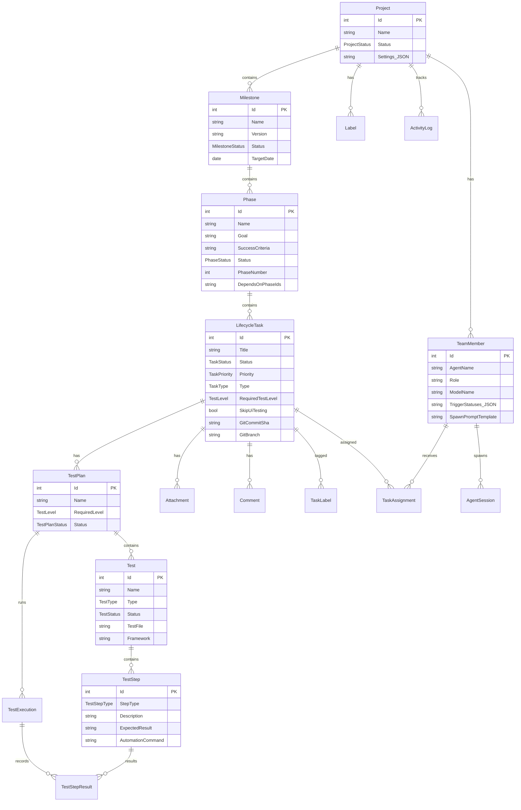

# Lifecycle Tracker — Data Model

## Key Enums

| Enum | Values |
|------|--------|
| TaskStatus | Backlog, Todo, InProgress, Review, Blocked, Done, Cancelled |
| TaskPriority | P1, P2, P3, P4 |
| TaskType | Feature, Bug, Refactor, Docs, Test, Infra, Research |
| PhaseStatus | NotStarted, Planning, InProgress, Review, Blocked, Completed, Cancelled |
| MilestoneStatus | Planning, InProgress, OnHold, Completed, Cancelled |
| TestLevel | Smoke, Comprehensive, FullE2E |
| TestType | Unit, Integration, UI, Manual |
| TestExecutionMode | Manual, AI_AgentBrowser, Playwright, Unit_xUnit, Unit_Vitest |
| TestStepType | Setup, Action, Assertion, Teardown |
