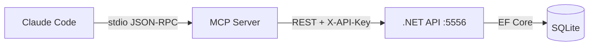

# Lifecycle Tracker — MCP Tools Reference

## Tool Groups

### Project (8 tools)
| Tool | Method | Endpoint |
|------|--------|----------|
| `list_projects` | GET | /api/projects |
| `set_active_project` | session state | (MCP-local) |
| `get_project_context` | GET | /api/ai/context?projectId= |
| `search_tasks` | GET | /api/tasks?query=&status=&priority=&phaseId= |
| `get_activity` | GET | /api/projects/{id}/activity?limit= |
| `get_metrics` | GET | /api/projects/{id}/metrics |
| `get_project_settings` | GET | /api/ai/settings?projectId= |
| `update_project_settings` | POST | /api/ai/settings |

### Task (4 tools)
| Tool | Method | Endpoint |
|------|--------|----------|
| `create_tasks` | POST | /api/ai/tasks/bulk-create |
| `start_task` | POST | /api/ai/tasks/{id}/transition (→InProgress) |
| `complete_task` | POST | /api/ai/tasks/{id}/transition (→Done) |
| `report_activity` | POST | /api/teams/{id}/activity |

### Phase (7 tools)
| Tool | Method | Endpoint |
|------|--------|----------|
| `create_phase` | POST | /api/milestones/{id}/phases |
| `get_phase` | GET | /api/phases/{id} |
| `list_phases` | GET | /api/milestones/{id}/phases |
| `update_phase` | PATCH | /api/phases/{id} |
| `delete_phase` | DELETE | /api/phases/{id} |
| `change_phase_status` | POST | /api/phases/{id}/status |
| `breakdown_phase` | POST | /api/ai/breakdown |

### Milestone (6 tools)
| Tool | Method | Endpoint |
|------|--------|----------|
| `list_milestones` | GET | /api/projects/{id}/milestones |
| `get_milestone` | GET | /api/milestones/{id} |
| `create_milestone` | POST | /api/projects/{id}/milestones |
| `update_milestone` | PATCH | /api/milestones/{id} |
| `change_milestone_status` | POST | /api/milestones/{id}/status |
| `delete_milestone` | DELETE | /api/milestones/{id} |

### Test Plan (5 tools)
| Tool | Method | Endpoint |
|------|--------|----------|
| `create_test_plan` | POST | /api/tasks/{id}/test-plans |
| `add_test_steps` | POST | /api/tests/{id}/steps |
| `start_test_execution` | POST | /api/test-plans/{id}/execute |
| `record_step_result` | POST | /api/test-plans/{id}/execute/{eid}/step/{sid} |
| `complete_test_execution` | POST | /api/test-executions/{id}/complete |

### Team (8 tools)
| Tool | Method | Endpoint |
|------|--------|----------|
| `list_team_members` | GET | /api/teams?projectId= |
| `create_team_member` | POST | /api/teams |
| `get_role_templates` | GET | /api/teams/role-templates |
| `get_triggered_agents` | GET | /api/teams/triggered?status= |
| `spawn_agent_session` | POST | /api/teams/{id}/spawn |
| `complete_agent_session` | POST | /api/teams/{id}/shutdown |
| `assign_task_to_agent` | POST | /api/teams/{id}/assign |
| `report_activity` | POST | /api/teams/{id}/activity |

### Utility (1 tool)
| Tool | Method | Endpoint |
|------|--------|----------|
| `upload_screenshot` | POST | /api/tasks/{id}/attachments |
