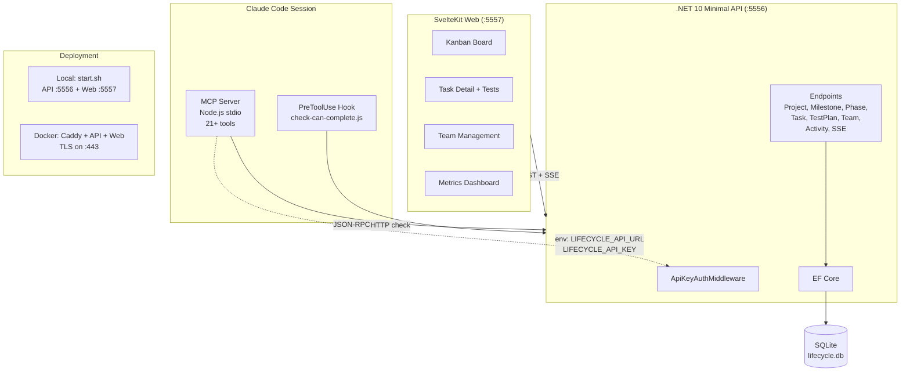

# Lifecycle Tracker — System Architecture

## Key Integration Points
- **MCP → API**: All lifecycle tools route through `api-client.ts` → REST endpoints
- **Hook → API**: `check-can-complete.js` calls `/api/tasks/{id}` + `/api/tasks/{id}/test-plans` + `/api/tasks/{id}/can-complete`
- **Web → API**: SvelteKit fetches via `/api/*`, receives SSE on `/api/events?projectId=X`
- **Auth**: Browser requests bypass API key (Origin header check); MCP/CLI use `X-API-Key` header
