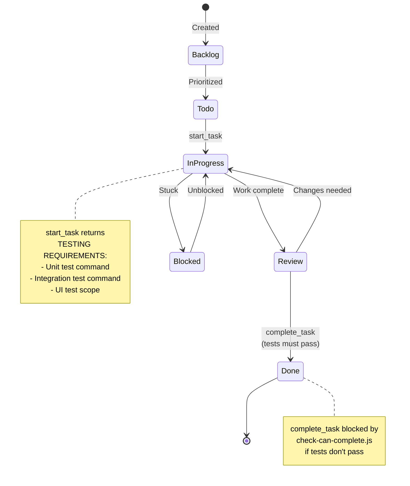
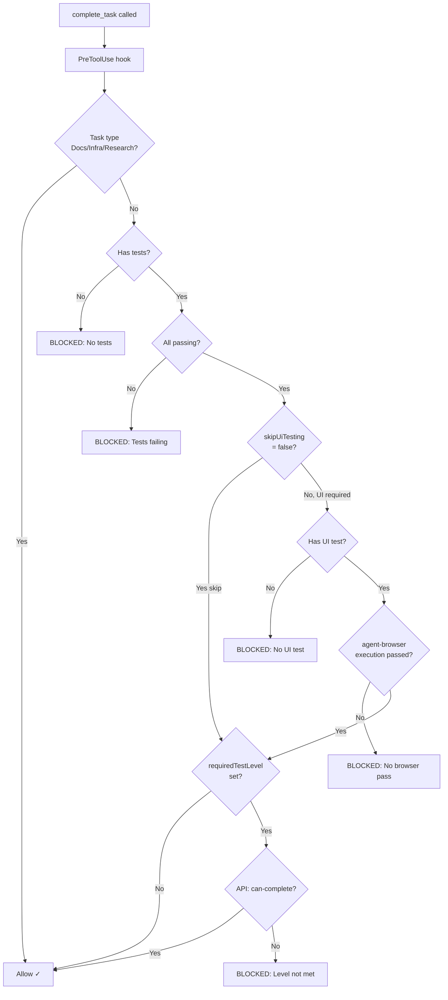
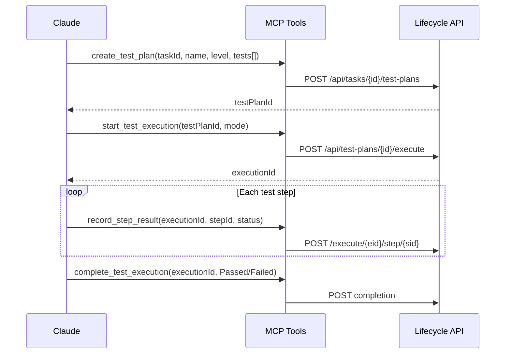

# Lifecycle Tracker — Task Lifecycle & Test Enforcement

## Task State Machine

```mermaid
stateDiagram-v2
    [*] --> Backlog: Created

    Backlog --> Todo: Prioritized
    Todo --> InProgress: start_task

    InProgress --> Review: Work complete
    InProgress --> Blocked: Stuck

    Blocked --> InProgress: Unblocked

    Review --> Done: complete_task<br/>(tests must pass)
    Review --> InProgress: Changes needed

    Done --> [*]

    note right of InProgress
        start_task returns
        TESTING REQUIREMENTS:
        - Unit test command
        - Integration test command
        - UI test scope
    end note

    note right of Done
        complete_task blocked by
        check-can-complete.js
        if tests don't pass
    end note
```

## Test Enforcement Gate (check-can-complete.js)

```mermaid
graph TD
    REQ[complete_task called] --> HOOK[PreToolUse hook]
    HOOK --> EXEMPT{Task type<br/>Docs/Infra/Research?}
    EXEMPT -->|Yes| ALLOW[Allow ✓]
    EXEMPT -->|No| HAS_TESTS{Has tests?}
    HAS_TESTS -->|No| BLOCK1[BLOCKED: No tests]
    HAS_TESTS -->|Yes| PASSING{All passing?}
    PASSING -->|No| BLOCK2[BLOCKED: Tests failing]
    PASSING -->|Yes| UI_REQ{skipUiTesting<br/>= false?}
    UI_REQ -->|Yes skip| LEVEL
    UI_REQ -->|No, UI required| HAS_UI{Has UI test?}
    HAS_UI -->|No| BLOCK3[BLOCKED: No UI test]
    HAS_UI -->|Yes| AB{agent-browser<br/>execution passed?}
    AB -->|No| BLOCK4[BLOCKED: No browser pass]
    AB -->|Yes| LEVEL{requiredTestLevel<br/>set?}
    LEVEL -->|No| ALLOW
    LEVEL -->|Yes| CAN_COMPLETE{API: can-complete?}
    CAN_COMPLETE -->|Yes| ALLOW
    CAN_COMPLETE -->|No| BLOCK5[BLOCKED: Level not met]
```

## Test Execution Flow

```mermaid
sequenceDiagram
    participant C as Claude
    participant MCP as MCP Tools
    participant API as Lifecycle API

    C->>MCP: create_test_plan(taskId, name, level, tests[])
    MCP->>API: POST /api/tasks/{id}/test-plans
    API-->>C: testPlanId

    C->>MCP: start_test_execution(testPlanId, mode)
    MCP->>API: POST /api/test-plans/{id}/execute
    API-->>C: executionId

    loop Each test step
        C->>MCP: record_step_result(executionId, stepId, status)
        MCP->>API: POST /execute/{eid}/step/{sid}
    end

    C->>MCP: complete_test_execution(executionId, Passed/Failed)
    MCP->>API: POST completion
```
